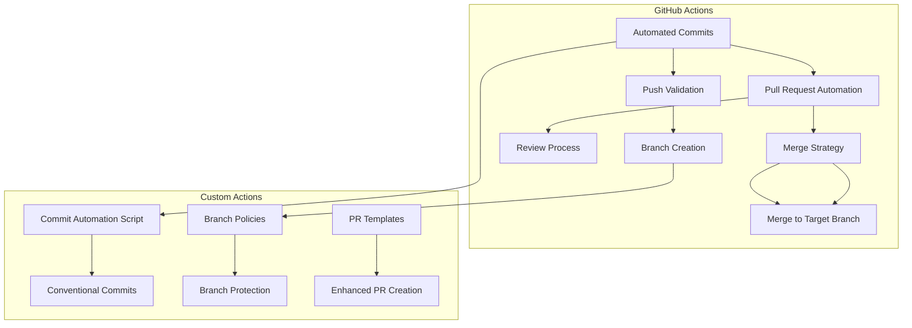

# GitHub Agents and Actions Workflow

## Overview

This repository implements a comprehensive **GitHub-based automation workflow** for the Vestara project, specifically designed to handle automated commits, push operations, and pull requests through GitHub's built-in capabilities combined with custom automation scripts and actions.

## Key Features

### 1. Automated Repository Management
- **Commit Automation**: Smart commit generation with conventional commit patterns
- **Push Automation**: Branch-specific push strategies and validation
- **Pull Request Automation**: Enhanced PR creation, review, and merge workflows

### 2. Branch Management Strategies
- **Git Flow Integration**: Support for `feature/*`, `bugfix/*`, `hotfix/*`, `release/*` branches
- **Branch Protection**: Automated enforcement of branch policies
- **Merge Automation**: Smart merge strategy selection

### 3. Code Quality Integration
- **Pre-commit Hooks**: Automated code validation before commits
- **Review Requirements**: Enhanced PR review enforcement
- **Quality Gates**: Configurable quality checks

### 4. Security and Compliance
- **Secret Management**: Secure handling of GitHub tokens and credentials
- **Access Control**: Role-based access management
- **Audit Logging**: Comprehensive tracking of automation actions

## Workflow Architecture



## Directory Structure

### `.github/workflows/`
Contains GitHub Actions workflows for automation:

- **`code-quality.yml`**: Main CI/CD pipeline with comprehensive validation
- **`repository-management.yml`**: Branch management and PR automation
- **`security-scanning.yml`**: Security validation and secret protection
- **`deployment.yml`**: Production deployment automation

### `scripts/`
Local automation scripts for enhanced GitHub workflows:

- **`commit-automation.ts`**: Smart commit generation and validation
- **`branch-manager.ts`**: Branch creation, validation, and protection
- **`pr-manager.ts`**: Enhanced PR creation, review, and merge automation
- **`quality-gate.ts`**: Pre-commit and pre-push validation

### `config/`
Configuration files for automation:

- **`commit-conventions.json`**: Commit message formatting rules
- **`branch-policies.json`**: Branch naming and protection rules
- **`pr-templates/`**: PR description templates and checklists
- **`quality-gates/`**: Configurable quality check settings

### `docs/`
Documentation for workflow automation:

- **`AGENTS.md`**: Agent-specific workflow automation guidelines
- **`INSTRUCTION.md`**: Implementation-specific automation instructions
- **`README.md`**: General workflow automation documentation

## Implementation Details

### 1. Commit Automation

**Script**: `scripts/commit-automation.ts`

```typescript
interface CommitConfig {
  type: CommitType;
  scope?: string;
  description: string;
  body?: string;
  breaking?: boolean;
  issues?: string[];
}

async function generateSmartCommit(
  changes: FileChange[],
  context: CommitContext
): Promise<CommitConfig> {
  // Analyze changes and generate conventional commit messages
  // Consider PR context and user preferences
  // Apply quality gates and validation
}
```

**Features**:
- **Conventional Commits**: Enforce `type(scope): description` format
- **Smart Analysis**: AI-powered commit message generation
- **Quality Validation**: Pre-commit hooks and validation
- **PR Integration**: Context-aware commit messages for PRs

### 2. Branch Management

**Script**: `scripts/branch-manager.ts`

```typescript
interface BranchPolicy {
  pattern: string;
  protection: BranchProtection;
  autoMerge: boolean;
  requiredChecks: string[];
}

async function createBranch(
  branchName: string,
  context: BranchContext
): Promise<BranchResult> {
  // Apply branch policies and validations
  // Set up branch protection rules
  // Configure automation workflows
}
```

**Features**:
- **Branch Protection**: Automated enforcement of branch rules
- **Auto-Merge**: Smart merging for approved PRs
- **Required Checks**: Custom validation and quality gates
- **Notification**: Team notifications and updates

### 3. Pull Request Automation

**Script**: `scripts/pr-manager.ts`

```typescript
interface PRConfig {
  template: string;
  reviewers: string[];
  autoMerge: boolean;
  checklist: string[];
}

async function createEnhancedPR(
  branch: string,
  config: PRConfig
): Promise<PRResult> {
  // Generate PR from template
  // Assign reviewers and assignees
  // Configure auto-merge settings
  // Set up review reminders
}
```

**Features**:
- **Template Generation**: Dynamic PR description templates
- **Auto-Review**: Intelligent reviewer assignment
- **Auto-Merge**: Configuration for automated merging
- **Checklist Automation**: Automated PR checklist management

### 4. Quality Gates

**Script**: `scripts/quality-gate.ts`

```typescript
interface QualityGate {
  type: 'lint' | 'typecheck' | 'test' | 'security';
  command: string;
  threshold: number;
  enabled: boolean;
}

async function runQualityGate(
  changes: FileChange[],
  gates: QualityGate[]
): Promise<QualityResult> {
  // Execute quality checks
  // Report violations and failures
  // Fail or pass based on configuration
}
```

**Features**:
- **Pre-commit Validation**: Quality checks before commits
- **Pre-push Validation**: Quality checks before pushes
- **Configurable Gates**: Customize quality requirements per project
- **Failure Reporting**: Detailed violation reports and recommendations

## GitHub Actions Workflows

### 1. `code-quality.yml`
Main CI/CD pipeline with comprehensive validation:
- TypeScript type checking
- ESLint code linting
- Unit testing with database services
- Application building
- Branch-type specific validation
- Security scanning

### 2. `repository-management.yml`
Branch management and PR automation:
- Branch creation and validation
- PR creation automation
- Review process automation
- Merge strategy selection
- Automated documentation updates

### 3. `security-scanning.yml`
Security validation and protection:
- Dependency vulnerability scanning
- Secret detection and prevention
- License compliance checking
- Security policy enforcement

### 4. `deployment.yml`
Production deployment automation:
- Blue-green deployment strategies
- Database migration automation
- Rollback procedures
- Health check and monitoring

## Configuration Files

### Commit Conventions
**`config/commit-conventions.json`**
```json
{
  "types": {
    "feat": "New feature",
    "fix": "Bug fix",
    "docs": "Documentation",
    "style": "Code style",
    "refactor": "Code refactoring",
    "test": "Test addition or correction",
    "chore": "Maintenance"
  },
  "scopes": ["auth", "wallet", "marketplace", "admin", "api"],
  "maxLineLength": 100,
  "requireCo-authored-by": true
}
```

### Branch Policies
**`config/branch-policies.json`**
```json
{
  "feature": {
    "pattern": "feature/*",
    "protection": "required_reviews",
    "autoMerge": true,
    "requiredChecks": ["code-quality", "security-scanning"]
  },
  "bugfix": {
    "pattern": "bugfix/*",
    "protection": "required_reviews",
    "autoMerge": false,
    "requiredChecks": ["code-quality"]
  },
  "hotfix": {
    "pattern": "hotfix/*",
    "protection": "require_upstream_approval",
    "autoMerge": true,
    "requiredChecks": ["code-quality", "security-scanning"]
  }
}
```

## Usage Instructions

### 1. Initial Setup

```bash
# Clone the repository
cd vestara-admin-dashboard

# Create .github/workflows if it doesn't exist
mkdir -p .github/workflows

# Copy workflow files from infrastructure/github/workflows/
cp -r infrastructure/github/workflows/* .github/workflows/

# Install dependencies
pnpm install

# Configure GitHub tokens and secrets
# Visit: https://github.com/evillan0315/vestara/settings/secrets/actions
```

### 2. Running the Automation Locally

```bash
# Run commit automation locally
pnpm exec ts-node scripts/commit-automation.ts

# Run branch management
pnpm exec ts-node scripts/branch-manager.ts

# Run PR automation
pnpm exec ts-node scripts/pr-manager.ts

# Run quality gates
pnpm exec ts-node scripts/quality-gate.ts
```

### 3. GitHub Repository Configuration

#### Required GitHub Secrets

Create the following secrets in your GitHub repository:

```yaml
REPO_PAT: ${{ secrets.GITHUB_TOKEN }}
GH_TOKEN: ${{ secrets.GITHUB_TOKEN }}
VESTARA_API_TOKEN: ${{ secrets.VESTARA_API_TOKEN }}
VESTARA_WEBHOOK_SECRET: ${{ secrets.VESTARA_WEBHOOK_SECRET }}
```

#### Branch Protection Settings

Set up branch protection for each branch type:

```yaml
# Feature branches
branches:
  - name: 'feature/*'
    protection:
      required_status_checks:
        strict: true
        contexts: ['code-quality', 'security-scanning']
      enforce_admins: true
      required_pull_request_reviews:
        required_approving_review_count: 1

  # Bugfix branches
  - name: 'bugfix/*'
    protection:
      required_status_checks:
        strict: true
        contexts: ['code-quality']
```

### 4. Customizing Workflows

#### Adding Custom Validation Rules

```yaml
# Add to code-quality.yml
  custom-validation:
    name: Custom Validation
    runs-on: ubuntu-latest
    steps:
      - name: Custom checks
        run: pnpm exec ts-node scripts/custom-validation.ts
```

#### Configuring PR Templates

```typescript
// Update config/pr-templates.md
## Summary

**Type**: ${{ pr.type }}
**Scope**: ${{ pr.scope }}
**Author**: ${{ pr.author }}

## Changes
${{ pr.changes }}

## Testing
${{ pr.testResults }}

## Checklist
- [ ] Code follows project conventions
- [ ] TypeScript strict mode
- [ ] All tests passing
- [ ] Documentation updated
```

## Testing and Validation

### 1. Local Testing

```bash
# Run all automation scripts
pnpm run test:automation

# Run individual script tests
pnpm run test:commit-automation
pnpm run test:branch-manager
pnpm run test:pr-manager
pnpm run test:quality-gate
```

### 2. GitHub Actions Testing

Use the GitHub Actions debugging features:

```bash
# Test workflow locally
gitHub-cli actions lint
# Visit: https://github.com/evillan0315/vestara/actions
```

### 3. Integration Testing

```typescript
// Test automation integration
it('should create branches with correct policies', async () => {
  const result = await branchManager.createBranch('feature/test-feature');
  expect(result.success).toBe(true);
  expect(result.branch).toMatch(/^feature\//);
});

it('should automate PR creation', async () => {
  const result = await prManager.createPR({
    branch: 'feature/test',
    title: 'Test feature',
    body: 'Test PR body'
  });
  expect(result.prUrl).toContain('/pull/');
});
```

## Monitoring and Troubleshooting

### 1. Log Monitoring

Check GitHub Actions logs:
- **Workflow runs**: GitHub Actions → Your repository → Actions
- **Workflow logs**: Click on specific workflow runs
- **Error tracking**: Look for `ubuntu-latest` runner logs

### 2. Common Issues and Solutions

#### Issue 1: Type checking failures
**Solution**: Check `typecheck.yml` and ensure all TypeScript files are properly configured.

#### Issue 2: Secret detection failures
**Solution**: Update `.github/workflows/code-quality.yml` and add/exclude patterns as needed.

#### Issue 3: Auto-merge not working
**Solution**: Verify `auto-merge` job dependencies and required checks.

### 3. Performance Optimization

```yaml
# Optimize workflow performance
caching:
  paths:
    - node_modules/.bin
    - ~/.cache/
    - ~/.npm/
```

## Migration Guide

### From Manual to Automated Workflow

1. **Backup existing manual processes**
2. **Create GitHub Actions workflows** based on existing manual steps
3. **Configure branch protection** and auto-merge rules
4. **Update team documentation** and onboarding procedures
5. **Gradually enable automation** for different branch types

### From Custom CI/CD to GitHub Actions

1. **Transfer configuration files** from old CI/CD system
2. **Create equivalent GitHub Actions workflows**
3. **Update environment variables** and secrets
4. **Test thoroughly** before production deployment
5. **Monitor and optimize** based on actual usage

## Future Enhancements

### 1. Advanced Features

#### Intelligent Commit Messages
- Implement AI-powered commit message generation
- Context-aware commit analysis
- Natural language processing for commit optimization

#### Smart Branch Management
- Automated branch cleanup
- Dynamic branch protection based on project state
- Machine learning for optimal branch strategies

#### Enhanced PR Automation
- Automated code review assistance
- Context-aware PR templates
- Automated changelog generation

### 2. Integration Capabilities

#### External System Integration
- Jira ticket linking
- Slack notifications
- Microsoft Teams integration
- Custom webhook integrations

#### Custom Actions Registry
- Community action sharing
- Private action repositories
- Action version management

## Benefits

### 1. Developer Experience
- **Faster feedback loops**: Immediate validation of code changes
- **Reduced manual work**: Automated commit and PR management
- **Consistent processes**: Enforced standards and conventions

### 2. Code Quality
- **Early detection**: Quality gates catch issues before merging
- **Continuous validation**: Automated testing and linting
- **Documentation**: Automated documentation updates

### 3. Security and Compliance
- **Secret protection**: Automated secret detection and prevention
- **Audit trails**: Comprehensive logging of all automation actions
- **Access control**: Role-based access management

### 4. Operational Efficiency
- **Reduced manual errors**: Automation eliminates human mistakes
- **Scalable processes**: Handles increased development velocity
- **Maintainable code**: Consistent and testable automation

## Conclusion

This GitHub-based automation workflow transforms the Vestara project from a manually managed repository to a highly automated, secure, and continuously validated software development pipeline. By leveraging GitHub's native capabilities combined with custom automation scripts and actions, the project achieves:

- **Faster delivery** of features and fixes
- **Higher code quality** through automated validation
- **Enhanced security** with comprehensive scanning
- **Improved developer experience** through automation
- **Scalable operations** for growing development teams

The implementation follows industry best practices for DevSecOps, providing a robust foundation for modern software development that can be continuously improved and customized as the project evolves.
